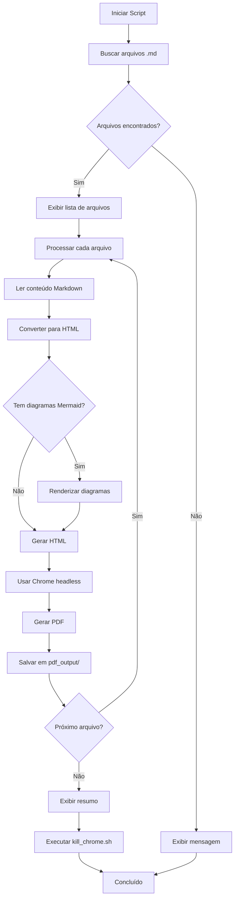

# BuildDocJS - Exportador de Markdown para PDF

> Projeto inspirado e derivado de: https://github.com/frkr/builddoc/tree/main

Script Node.js para exportar documentos Markdown para PDF formatado profissionalmente. Converte todos os arquivos `.md` da raiz do projeto em PDFs com numeração, índices e formatação profissional, incluindo suporte completo para renderização de diagramas Mermaid.js.

## 🚀 Funcionalidades

### Principais Recursos

- **Conversão Automática**: Processa automaticamente todos os arquivos Markdown (`.md`) encontrados na raiz do projeto
- **Formatação Profissional**: Gera PDFs com formatação profissional incluindo:
  - Títulos hierárquicos com tamanhos e cores diferenciados
  - Código formatado com syntax highlighting
  - Tabelas com bordas e estilização
  - Citações e listas formatadas
  - Quebras de página inteligentes
- **Suporte a Mermaid.js**: Renderiza diagramas Mermaid.js diretamente nos PDFs:
  - Diagramas de fluxo
  - Gráficos de sequência
  - Diagramas de classe
  - E todos os outros tipos de diagramas suportados pelo Mermaid
- **Chrome Headless**: Utiliza Chrome/Chromium em modo headless para renderização de alta qualidade
- **Processamento Sequencial**: Processa arquivos um por vez para garantir estabilidade
- **Resumo Detalhado**: Exibe resumo completo do processamento com contagem de sucessos e erros
- **Limpeza Automática**: Executa script de limpeza de processos Chrome após o processamento

### Detalhes Técnicos

- **Formato de Página**: A4 com margens de 2.5cm (topo/rodapé) e 2cm (laterais)
- **Fonte**: DejaVu Sans para texto e DejaVu Sans Mono para código
- **Renderização**: Aguarda renderização completa dos diagramas Mermaid antes de gerar o PDF
- **Timeout**: Timeout de segurança de 10 segundos por diagrama Mermaid
- **Diretório de Saída**: Cria automaticamente o diretório `pdf_output/` na raiz do projeto

## 📋 Requisitos

- **Node.js**: Versão compatível (verifique `.nvmrc` se existir)
- **Chrome/Chromium**: Google Chrome, Chromium ou Microsoft Edge instalado
- **Dependências NPM**:
  - `puppeteer`: Para controle do navegador
  - `marked`: Para conversão de Markdown para HTML

## 🛠️ Instalação

1. Clone ou baixe o projeto
2. Instale as dependências:

```bash
npm install
```

3. Se houver arquivo `.nvmrc`, use a versão correta do Node.js:

```bash
nvm use
```

## 📖 Como Usar

Execute o script na raiz do projeto:

```bash
node export_pdf.js
```

Ou, se o arquivo tiver permissão de execução:

```bash
./export_pdf.js
```

### O que acontece:

1. O script busca todos os arquivos `.md` na raiz do projeto
2. Exibe uma lista dos arquivos que serão processados
3. Processa cada arquivo sequencialmente:
   - Converte Markdown para HTML
   - Renderiza diagramas Mermaid.js
   - Gera PDF usando Chrome headless
4. Salva os PDFs no diretório `pdf_output/`
5. Exibe resumo do processamento
6. Executa `kill_chrome.sh` para limpar processos do Chrome

### Estrutura de Saída

```
projeto/
├── README.md
├── documentacao.md
├── pdf_output/
│   ├── README.pdf
│   └── documentacao.pdf
└── ...
```

## 🎨 Exemplo de Diagrama Mermaid

Abaixo está um diagrama de fluxo Mermaid.js para testar a funcionalidade de exportação:



## 🔧 Configuração

### Variáveis de Ambiente

Você pode configurar o caminho do Chrome usando variáveis de ambiente:

- `PUPPETEER_EXECUTABLE_PATH`: Caminho completo para o executável do Chrome
- `CHROME_PATH`: Caminho alternativo para o Chrome

### Caminhos Padrão Verificados

O script verifica automaticamente os seguintes caminhos (macOS):

- `/Applications/Google Chrome.app/Contents/MacOS/Google Chrome`
- `/Applications/Chromium.app/Contents/MacOS/Chromium`
- `/Applications/Microsoft Edge.app/Contents/MacOS/Microsoft Edge`

## 📝 Notas

- O script processa apenas arquivos `.md` na **raiz** do projeto (não recursivo)
- Arquivos são processados em ordem alfabética
- O diretório `pdf_output/` é criado automaticamente se não existir
- Diagramas Mermaid são renderizados com tema `default`
- O script aguarda até 10 segundos por diagrama Mermaid para garantir renderização completa

## 🐛 Solução de Problemas

### Chrome não encontrado

Se você receber um erro sobre Chrome não encontrado:

1. Instale o Google Chrome, Chromium ou Microsoft Edge
2. Ou defina a variável de ambiente `CHROME_PATH` com o caminho completo

### Diagramas Mermaid não aparecem

- Verifique se a sintaxe do diagrama está correta
- O script aguarda até 10 segundos para renderização
- Verifique o console do navegador para erros (se usar modo debug)

### Erros de permissão

Certifique-se de que o script tem permissão de execução:

```bash
chmod +x export_pdf.js
chmod +x kill_chrome.sh
```

## 📄 Licença

Veja o arquivo [LICENSE](LICENSE) para mais detalhes.
