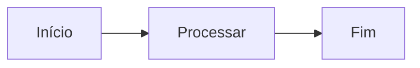

# Documento de Exemplo

> Fixture E2E sintética para o BuildDocJS. Sem dados de cliente.

## Introdução

Este documento testa o pipeline completo: headings, listas, código, tabelas,
Mermaid e links.

## Código JavaScript

```javascript
function saudacao(nome) {
  return `Olá, ${nome}!`;
}
console.log(saudacao('Mundo'));
```

## Diagrama Mermaid



## Tabela

| Nome | Valor |
|---|---|
| A | 1 |
| B | 2 |

## Links

- [Exemplo](https://example.com)
- [Seção de código](#código-javascript)
